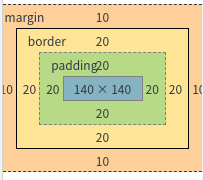
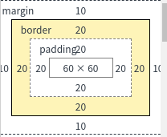

# box-sizing

标签（空格分隔）： css3 box-sizing

---

其实以前我这个半吊子前端，经常看见有人使用它，但是不知道为什么。

正好今天看到了这里就了解一下。

### 基础

其实就是盒子模型的不同解释

**w3c标准**

content(内容大小) + padding + border + margin = 实际大小

**IE6**

实际大小 = 内容大小。

内容大小 = padding + border + margin + content(内容大小, 根据内边距，边框，外边距浮动)。


```
box-sizing ： content-box || border-box || inherit
```

-  content-box  就是w3c标准值。 也是默认值
-  border-box 就是IE6这种模式
-  inherit 继承父级别 `box-sizing`

其实现在已经不用支持 **IE6** 了，甚至大部分公司都只需要支持到 **IE11**。

在这种前提下 `box-sizing` 是全浏览器支持的。

你可一选择一种模式，根据你需要的情况来选择。

### 实例

**html**

```
<div class="imgBox" id="contentBox">
</div>
<div class="imgBox" id="borderBox">
</div>
```

**css**

```
.imgBox img {
	width: 140px;
	height: 140px;
	padding: 20px;
	border: 20px solid orange;
	margin: 10px;
}

#contentBox img {
	-moz-box-sizing: content-box;
	-webkit-box-sizing: content-box;
	-o-box-sizing: content-box;
	-ms-box-sizing: content-box;
	box-sizing: content-box; 
}

#borderBox img {
	-moz-box-sizing: border-box;
	-webkit-box-sizing: border-box;
	-o-box-sizing: border-box;
	-ms-box-sizing: border-box;
	box-sizing: border-box;
}
```

同样设置 图片的宽度和高度，padding & border & margin。

但是设置不同的 `box-sizing` 的不同效果。

  
 
 

看这个图就明明白白的

`border-box` 整体 **140px**
`content-box` 整体 **240px**

这就是区别。


