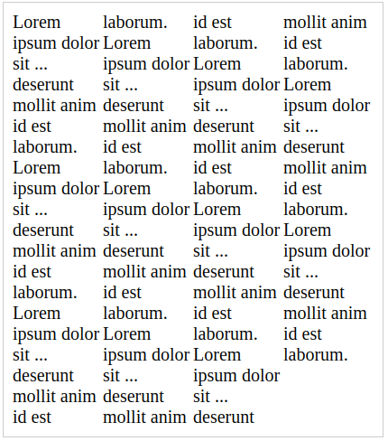
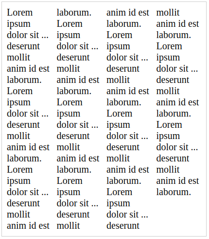
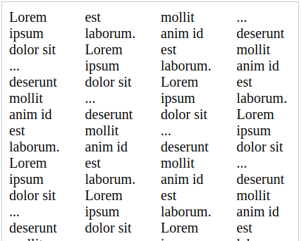
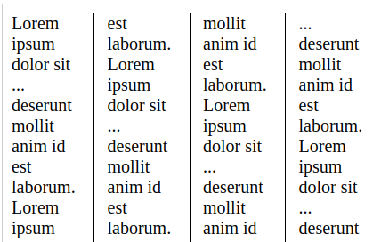
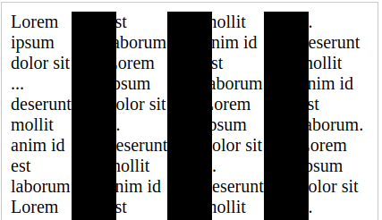

# 关于column

首先 `column` 作用在于可以提供报纸这种体验。

虽然　`float` 和 `flex` 还有　`grid`  都能很轻松实现这个布局，但是文字拆分就没那么简单了。

**column** 就是为了这种场景.

### 1. api

- column-width　用于定义每一列的宽度	
- column-count　有多少列
- column-gap　　列间距
- column-rule　　可以理解为列的边框

#### 1.1 width

首先不能设置 `column-count`.

以下是 **demo**

```
.columns {

  font-size: 20px;

  .demo {
    width: 400px;
    border: 1px solid #ccc;
    padding: 10px;
  }
  
  .columnCountAuto {
    column-width: 100px ;
    column-gap: 0px;
  }
}

<div class="columns">
	<div class="demo columnCountAuto">
		Lorem ipsum dolor sit ... deserunt mollit anim id est laborum.
		Lorem ipsum dolor sit ... deserunt mollit anim id est laborum.
		Lorem ipsum dolor sit ... deserunt mollit anim id est laborum.
		Lorem ipsum dolor sit ... deserunt mollit anim id est laborum.
		Lorem ipsum dolor sit ... deserunt mollit anim id est laborum.
		Lorem ipsum dolor sit ... deserunt mollit anim id est laborum.
		Lorem ipsum dolor sit ... deserunt mollit anim id est laborum.
		Lorem ipsum dolor sit ... deserunt mollit anim id est laborum.
		Lorem ipsum dolor sit ... deserunt mollit anim id est laborum.
		Lorem ipsum dolor sit ... deserunt mollit anim id est laborum.
		Lorem ipsum dolor sit ... deserunt mollit anim id est laborum.
	</div>
</div>
```
我这里将列间距清零，`400 / 4`, 4列，每一列100px. 

结果如下图

 

#### 1.2 count

不可与 `column-count` 同用或者你可设置为 `auto`.

与你直接设置来算不同，你可以直接设置 `column-count`。

让浏览器自己来分。

```
.columnCountAuto {
	column-count: 4;
	column-gap: 0px;
}
```

结果和 1.1 是一样的。

#### 1.3 gap

中间间隔

```
  .columnCountAuto {
    column-count: 4;
    column-gap:10px;
  }
```



```
  .columnCountAuto {
    column-count: 4;
    column-gap:30px;
  }
```



这就看出差别了吧。

中间的设置中间间隔

#### 1.4 rule

你可以理解为边框，就是你 `gap` 中背景的宽度，且是不占据任何宽度。

```
  .columnCountAuto {
    column-count: 4;
    column-gap:30px;
    column-rule: 1px solid black;
  }
```



如果你超过`30px`呢？



你会遮盖住文字。

### 以上
	