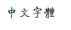
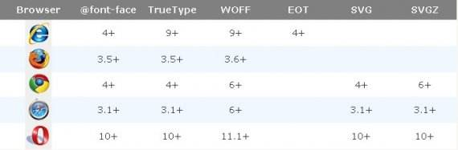

#  关于font-face

其实一直没有用过，一般会这样写

```
font-family: verdana, 'Microsoft YaHei', arial, 'Hiragino Sans GB', sans-serif;
```

也就是选择系统已有字体。

但是在不同的操作系统下，其实支持的操作系统是不一样的。

也就是说以下3种情况

- 选择操作系统大都支持的字体

比如说 `verdana`

- 多用几个字体

如上面代码中多写几个字体，总会用到你支持那个

- 不管

比如以前我总爱写 `微软雅黑`。 其他不支持的系统会替换为默认字体吧。

禁锢很多，可能还需要用户去下字体。

### 1. 基础

在 **css3** 中解决了这个问题

就是 `@font-face`. 能够引入字体，由浏览器下载。

```
 @font-face {
      font-family: <YourWebFontName>;
      src: <source> [<format>][,<source> [<format>]]*;
      [font-weight: <weight>];
      [font-style: <style>];
      [unicode-range:<支持的字符返回>];
      [font-stretch<字体的形态>];
    }
```

#### 1.1 font-family

自定义字体的名称。 完全自定义，不过还是建议使用原来的名字，好认一点

#### 1.2 src

路径。

可以多条，也就是如下

```
@font-face {
	font-family: 'YourWebFontName';
	src: url('YourWebFontName.eot?') format('eot');/*IE*/
	src:url('YourWebFontName.woff') format('woff'), url('YourWebFontName.ttf') format('truetype');/*non-IE*/
   }
```

既可以使用相对路径也可以使用绝对路径，还可以直接使用 **cdn**.

#### 1.3 font-stretch	

可选选项.

定义字体如何被拉长，默认值 `normal`

```
normal
condensed
ultra-condensed
extra-condensed
semi-condensed
expanded
semi-expanded
extra-expanded
ultra-expanded
```

#### 1.4 font-style	

可选选项

```
normal
italic
oblique
```

#### 1.5 font-weight	

可选选项，定义字体粗细。

### 2. 实例

```
@font-face {
  font-family: 'mbsfzt';
  src: url(../font/mbsfzt.TTF) format('truetype');
}
```

这里自定义了名称叫做 **mbsfzt**.

以及路径，我使用的是相对路径。

就达到了对应效果

 

也就是引用了字体

还有就是我没有设置其他的选项，可选选项。

原因是我觉得在这里面设置不太好，建议还是在其他 **css** 中设置，而不是在这里总体去设置

### 3. 关于浏览器兼容

 

根据这个图，如果你想要兼容所有浏览器，其实还是挺麻烦的。

```
@font-face {
	font-family: 'YourWebFontName';
	src: url('YourWebFontName.eot'); /* IE9 Compat Modes */
	src: url('YourWebFontName.eot?#iefix') format('embedded-opentype'), /* IE6-IE8 */
	     url('YourWebFontName.woff') format('woff'), /* Modern Browsers */
	     url('YourWebFontName.ttf')  format('truetype'), /* Safari, Android, iOS */
	     url('YourWebFontName.svg#YourWebFontName') format('svg'); /* Legacy iOS */
   }
```

这是抄 `w3cplus` 中的一段代码，我并没有进行具体测试. 等我具体需要用到的收再继续。

#### 3.1 关于如何统一字体。

当你决定用一种很特殊的字体的时候，比如你只有 **ttf** 格式。

其他格式字体并没有。

**w3cplus** 推荐 [http://www.fontsquirrel.com/fontface/generator](http://www.fontsquirrel.com/fontface/generator)   这个网站可以相互转换。

就可以统一字体。

### 4. 关于性能。

建议是使用  **woff** 和 **eot** 两种字体。

因为压缩的关系， **woff** 会比较小。 然而有时候为了兼容低版本IE，你不得不使用 **eot**.


 

