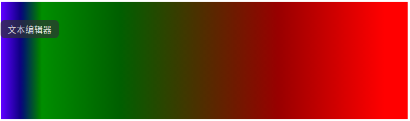
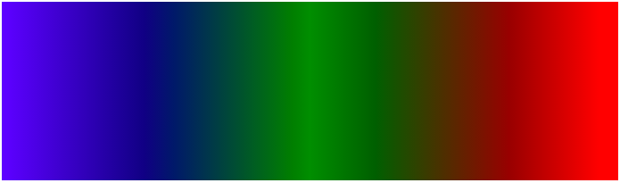
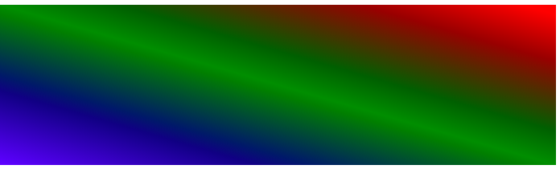
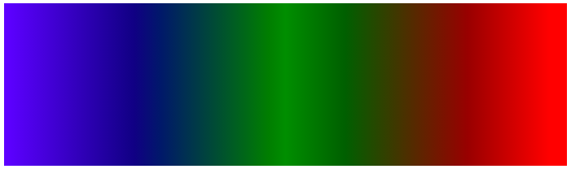

# 关于 linear-gradient

### 浏览器兼容性

#### firefox

```
-moz-linear-gradient( [<point> || <angle>,]? <stop>, <stop> [, <stop>]* )
```

firefox 老api,现在已经支持了标准写法

#### chrome 

```
-webkit-linear-gradient( [<point> || <angle>,]? <stop>, <stop> [, <stop>]* )
```

chrome 老api，现在已经支持了新写法

#### 老opera

```
-o-linear-gradient([<point> || <angle>,]? <stop>, <stop> [, <stop>]); 
```

**opera** 已经放弃了自己的架构 , 采用 `WebKit`内核，新版本已经不需要这样写了

#### IE8,9

IE8

```
-ms-filter: "progid:DXImageTransform.Microsoft.gradient (GradientType=0, startColorstr=#1471da, endColorstr=#1C85FB)";/*IE8+*/
```
IE9

```
filter: progid:DXImageTransform.Microsoft.gradient(GradientType=0, startColorstr=#1471da, endColorstr=#1C85FB);/*IE<9>*/
```

IE8,9是用`fliter`来实现的

####  标准接口

```
linear-gradient([ [ [ <angle> | to [top | bottom] || [left | right] ],]? <color-stop>[, <color-stop>]+);
```

#### 关于兼容性

如果你需要兼容老版本浏览器，可能`IE filter 你需要使用，以及老版本的写法`


```
background: -moz-linear-gradient(left top, blue, red);
background: -webkit-linear-gradient(left top, blue, red);
background: linear-gradient(to right bottom, blue, red);
```

ie10+，主流浏览器最新版本都支持标准写法

### 标准接口用法

```
linear-gradient([ [ [ <angle> | to [top | bottom] || [left | right] ],]? <color-stop>[, <color-stop>]+);
```
#### 关于颜色 <color-stop>

```
background: linear-gradient(blue, red);
```


从上倒下的蓝绿，渐变。

`linear-gradient` 参数 `<color-stop>`一个开始，一个结束。比如上面的列子，就是**蓝色** > **绿色**。

中间可以插入其他颜色

```
background: linear-gradient(blue, green, red);
```


你还可以加入更多颜色。

当你第一个不传参数，系统默认是从上到下。

```
background: linear-gradient(blue, red);
```


从上倒下的蓝绿，渐变。

`linear-gradient` 参数 `<color-stop>`一个开始，一个结束。比如上面的列子，就是**蓝色** > **绿色**。

中间可以插入其他颜色

```
background: linear-gradient(blue, green, red);
```


你还可以加入更多颜色。

#### 关于渲染范围

```
background: linear-gradient(to right,blue, green 10%, red);
```



从下到上，从蓝色开始渐变、到高度10%位置是绿色渐变开始、最后以红色结束。

这个可以设定渲染的范围。

#### 关于方向

除了从上倒下，还可以有其他选择。

第一个参数中 `to [top | bottom]`

```
background: linear-gradient(to right,blue, green, red);
```



`to right` 从左到右

自然也可以 

`to left` 从右到左
`to top` 从下到上
`to bottom` 从上到下

参数中还可以连起来 `to [top | bottom] || [left | right]`

```
background: linear-gradient(to right top,blue, green, red);
```

这两连起来就是从 **左下**到**右上**。



也可以类似这种组合

- `to right bottom` **左上**到**右下**.
- `to left top` **右下**到**左上**
- `to left bottom` **右上**到**左下**

#### 关于角度

第一个参数中还有一个 `<angle>`

可以调整角度，角度有几个单位

```
90deg = 100grad = 0.25turn ≈ 1.570796326794897rad

background: linear-gradient(90deg,blue, green, red); 
```



原本从上到下，`90deg` 就相当于旋转 **90度**.

其他计量单位，就可直接去换算了。

不过旋转的角度自由度更大一点。


### 以上
