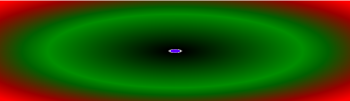
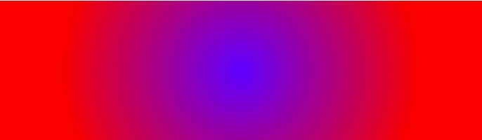
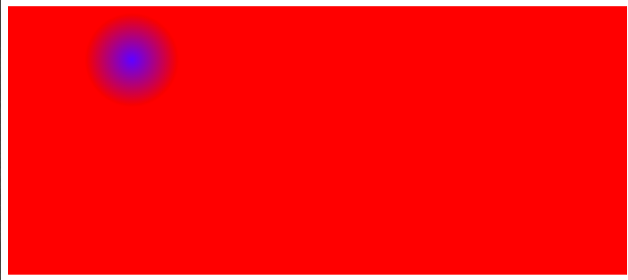

# 关于radial-gradient()

### 1. 浏览器兼容性

其实和  `linear-gradient` 差不多太

```
background: -webkit-radial-gradient(blue, red);
background: -o-radial-gradient(blue, red);
background: radial-gradient(blue, red); 
```

如果要兼容老式浏览器，这样写即可。

老式浏览器不包含 **IE9及其以下**

```
background: radial-gradient(blue, red); 
```

是目前的标准写法，主流浏览器的新版本都支持。

### 2. 关于颜色

#### 2.1. 基础颜色

```
background: -webkit-radial-gradient(blue, red);
background: -o-radial-gradient(blue, red);
background: radial-gradient(blue, red); 
```


首先需要在这里说清楚的是 `radial-gradient` 是以中心向两周扩散的。

所以会得到以蓝色为中心，向四周扩展然后红色继续扩散

为什么要用扩散？ 因为他是渐变的

#### 2.2 颜色叠加

颜色是可以叠加，不仅仅是2种颜色，理论上可以无限种颜色

```
background: -webkit-radial-gradient(blue, white, black, green, red);
background: -o-radial-gradient(blue, white, black, green, red);
background: radial-gradient(blue, white, black, green, red); 
```


会平均的散开

#### 2.3 颜色断点

```
background: -webkit-radial-gradient(blue 10px, white 10px, black 15px, green, red);
background: -o-radial-gradient(blue 10px, white 10px, black 15px, green, red);
background: radial-gradient(blue 10px, white 10px, black 15px, green, red); 
```



这个其实是我在 `linear-gradient` 中理解的不透彻的地方

```
background: radial-grad	ient(blue 10px, white 10px, black 15px, green, red); 
```
由于 `blue` 是从 **10px** 开始，其实默认等于  `blue,blue 10px`.
从 `blue` 开始 **0 - 10px** 渲染 `blue`
从 **10px** 开始渲染 `white` **10px-15px** 开始渐变到 `black`
到 **15px** 完成渐变为纯黑 后续依照默认的的分配 `black -> green -> red`

`linear-gradient` 中原理也和这个一样，只不过方向不同罢了。

接下来还能说的是，不仅仅支持 `px` 还支持其他单位，比如 `%`,以半径来计算。

### 3. 形状

#### 3.1 circle 圆形


```
background: -webkit-radial-gradient(circle, blue, red);
background: -o-radial-gradient(circle, blue, red);
background: radial-gradient(circle, blue, red);
```


其实默认就是圆形，加和没加效果是一样的。

#### 3.2 ellipse 椭圆形

```
background: -webkit-radial-gradient(100px 200px ellipse,  yellow, red);
background: -o-radial-gradient(100px 200px ellipse,  yellow, red);
background: radial-gradient(100px 200px ellipse,  yellow, red); }
```


椭圆和圆形不一样的地方是，你必须要设置坐标轴。
```
x = 100px
y = 200px
```

才能出现椭圆的效果。


### 4. 位置和大小

#### 4.1 大小

椭圆可以通过`x,y`来控制，圆圈则只有一个直径来控制大小。

```
background: -webkit-radial-gradient(300px circle, blue, red);
background: -o-radial-gradient(300px circle, blue, red);
background: radial-gradient(300px circle, blue, red);
```



圆圈的大小 `300px`, 可以超出容器的宽度。

#### 4.2 位置

默认是容器的中心位置。但是你可以自己设置

```
background: -webkit-radial-gradient(250px 250px, circle, blue, red);
background: -o-radial-gradient(250px 250px, circle, blue, red);
background: radial-gradient(circle at 250px 250px, blue, red);
```


以容器 `x,y` 都等于 `250px` 作为中心点，但是需要记住的是，如果你不设置直径，他会以默认直径展示。

还有单位依然可以使用 `%`。

#### 4.3 置顶渐变终点位置

- closest-side	渐变中心距离容器最近的边作为终止位置。
- closest-corner	渐变中心距离容器最近的角作为终止位置。
- farthest-side	渐变中心距离容器最远的边作为终止位置。
- farthest-corner	渐变中心距离容器最远的角作为终止位置。

```
background: -webkit-radial-gradient(20% 20%, closest-side circle, blue, red);
background: -o-radial-gradient(20% 20%, closest-side circle, blue, red);
background: radial-gradient(closest-side circle at 20% 20%, blue, red);
```



这个很好理解，如果你没有自定义起始位置。 这个是无效的。因为他都是等距的。

但是如果你自定以了起点位置，那么就就按照字面上的意思

### 5. 叠加

不仅仅只有一个背景，同时你还可以叠加处理。

```
 background:radial-gradient(50px 100px ellipse, transparent, yellow 90%, red), radial-gradient(circle, transparent, black 37px, transparent 46px);
```


很简单，写两个。

一个椭圆，椭圆中间有一个圆圈。

### 6. 重复

```
background:radial-gradient(black ,black 5px, white 5px,white 15px)
```

这是普通写法，效果就是 内圈`5px`黑色，外圈 `10px` 白色。总大小 `15px`

如果你使用重复的语法

```
background:repeating-radial-gradient(black ,black 5px, white 5px,white 15px)
```


他会不停的重复转圈。


### 7. 以上


